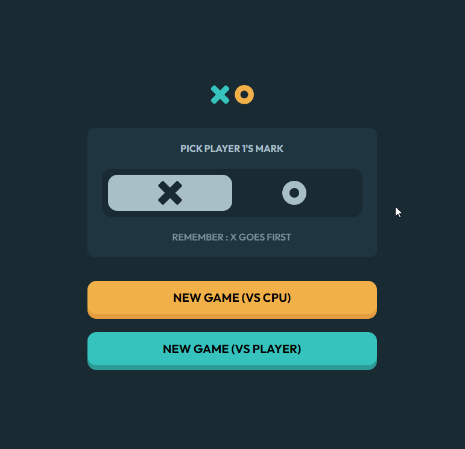

# Tic Tac Toe solution

This is a solution to the [Tic Tac Toe challenge on Frontend Mentor](https://www.frontendmentor.io/challenges/tic-tac-toe-game-Re7ZF_E2v).

## Table of contents

- [Tic Tac Toe solution](#tic-tac-toe-solution)
  - [Table of contents](#table-of-contents)
  - [Overview](#overview)
    - [The challenge](#the-challenge)
    - [Screenshot](#screenshot)
    - [Links](#links)
  - [My process](#my-process)
    - [Built with](#built-with)
    - [What I learned](#what-i-learned)
    - [Optimizations](#optimizations)
  - [Install](#install)
  - [Author](#author)


## Overview

### The challenge

Users are able to:

- View the optimal layout for the game depending on their device's screen size (lowest 340px)
- See hover states for all interactive elements on the page
- Play the game either solo vs the computer or multiplayer against another person
- Bonus 1: Instead of having the computer randomly make their moves, try making it clever so it’s proactive in blocking your moves and trying to win
<!-- - Bonus 2: Save the game state in the browser so that it’s preserved if the player refreshes their browser -->

### Screenshot



### Links

- Live URL: [Live site](https://brilliant-granita-ac585f.netlify.app/)

## My process

### Built with

- Semantic HTML5 markup
- Sass
- CSS custom properties
- Grid
- Flexbox
- JavaScript
- OOP
- WebPack
<!-- - localStorage -->

### What I learned

To make the Tic Tac Toe game against CPU unbeatable I applied [minimax algorithm](https://en.wikipedia.org/wiki/Minimax) (which you can find [here](https://www.freecodecamp.org/news/how-to-make-your-tic-tac-toe-game-unbeatable-by-using-the-minimax-algorithm-9d690bad4b37/)). I also have been experimenting with webpack and I can see how this tool can be useful when working on bigger projects. Debugging with webpack, ES6 and Babel can be less convenient, next time I'll have to look up webpack source-map. 


### Optimizations

localStorage could be implemented.

## Install

1. Clone the repository
``` bash
git clone https://github.com/marijanasevo/Tic-Tac-Toe-game.git
```

2. Change into the project directory:
```bash
cd Tic-Tac-Toe-game
```

3. Install dependencies `npm install`

4. Start the application with `npm run serve`
or run `npm run build` to bundle your application.


## Author

- Website - [webdevlpr.com](https://webdevlpr.com/)
- Frontend Mentor - [@Curiositz](https://www.frontendmentor.io/profile/Curiositz)