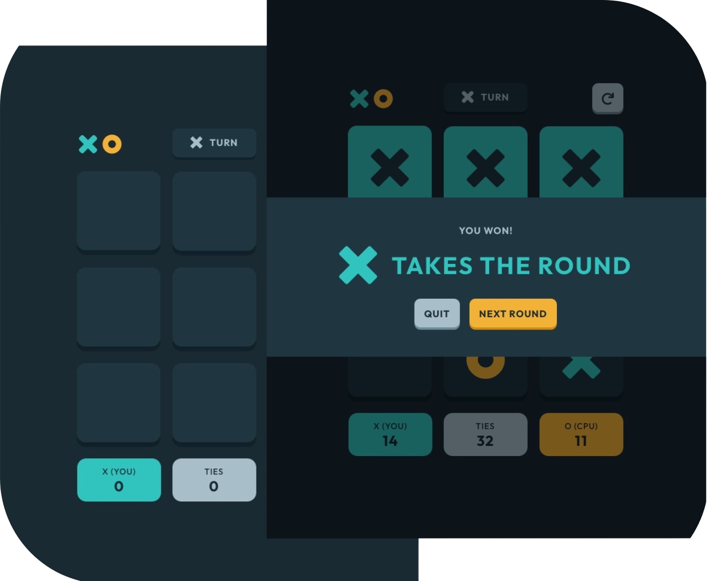

# Tic Tac Toe solution - in progress

This is a solution to the [Tic Tac Toe challenge on Frontend Mentor](https://www.frontendmentor.io/challenges/tic-tac-toe-game-Re7ZF_E2v).

<!-- ## Table of contents

- [Tic Tac Toe solution](#frontend-mentor---news-homepage-solution)
  - [Table of contents](#table-of-contents)
  - [Overview](#overview)
    - [The challenge](#the-challenge)
    - [Screenshot](#screenshot)
    - [Links](#links)
  - [My process](#my-process)
    - [Built with](#built-with)
    - [What I learned](#what-i-learned)
    - [Optimizations](#optimizations)
  - [Author](#author) -->


## Overview

### The challenge

Users are able to:

- View the optimal layout for the game depending on their device's screen size
- See hover states for all interactive elements on the page
- Play the game either solo vs the computer or multiplayer against another person
- Bonus 1: Save the game state in the browser so that it’s preserved if the player refreshes their browser
- Bonus 2: Instead of having the computer randomly make their moves, try making it clever so it’s proactive in blocking your moves and trying to win

### Screenshot



<!-- ### Links

- Live Site URL: [Live site](https://marijanasevo.github.io/tic-tac-toe-game/) -->

## My process

### Built with

- Semantic HTML5 markup
- Sass
- CSS custom properties
- Grid
- Flexbox
- JavaScript
- WebPack

<!-- ### What I learned

I've been playing with webpack just to get a feel of it.  -->


<!-- ### Optimizations

... -->

## Install

1. Clone the repository
``` bash
git clone https://github.com/marijanasevo/Tic-Tac-Toe-game.git
```
2. Change into the project directory:
```bash
cd Tic-Tac-Toe-game
```
3. Install dependencies
```bash
npm install
```
4. Start the application
```bash
npm run serve
```
or run `npm run build` to bundle your application.


## Author

- Website - [webdevlpr.com](https://webdevlpr.com/)
- Frontend Mentor - [@Curiositz](https://www.frontendmentor.io/profile/Curiositz)